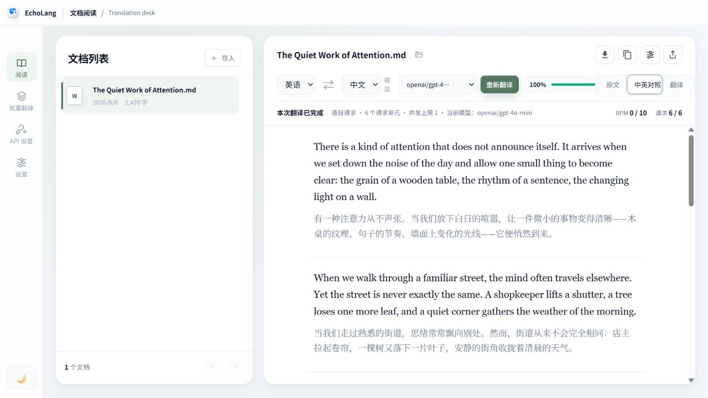
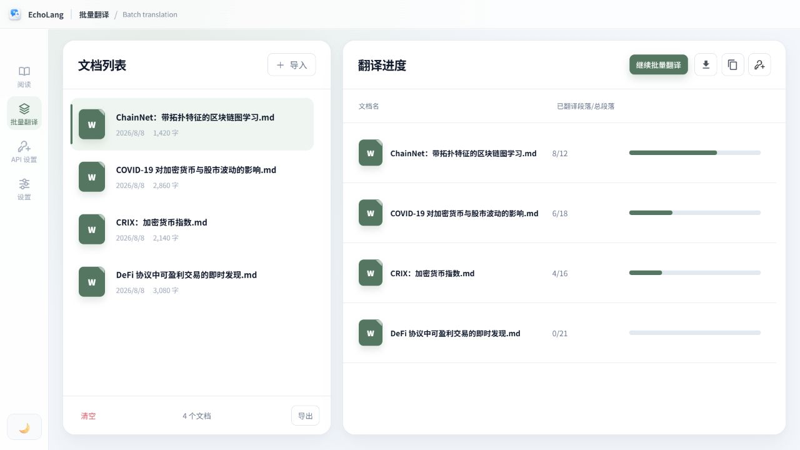
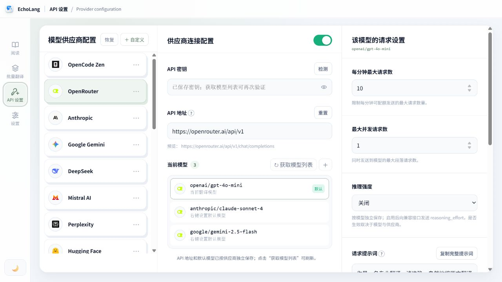
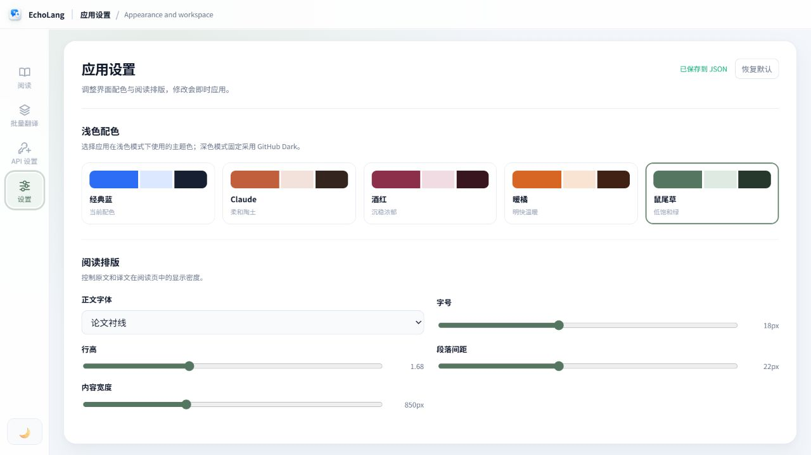
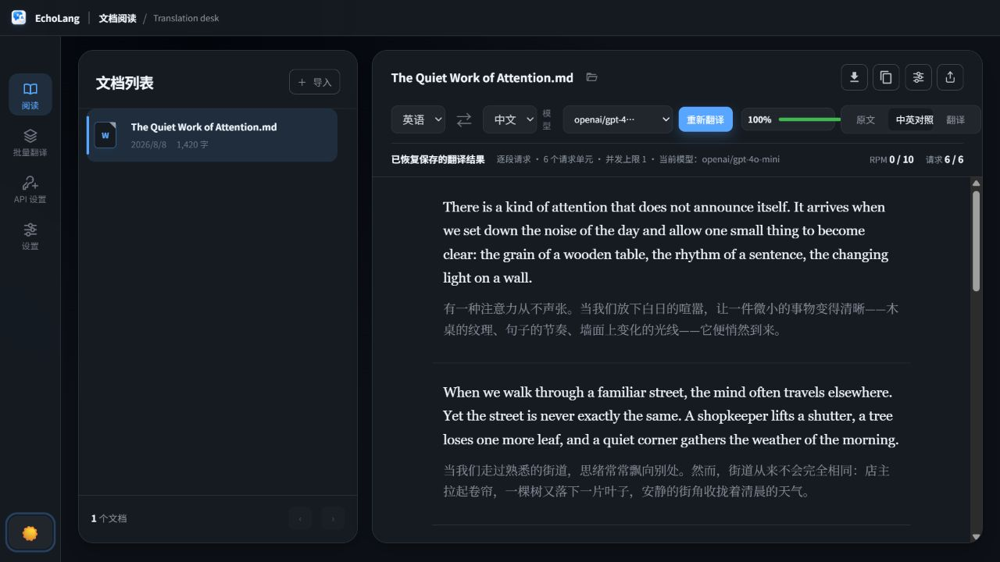

<div align="center">
  
  <h1>EchoLang</h1>
  <p><strong>Long documents deserve more than a chat box.</strong></p>
  <p>为论文、报告与长文档而生的本地优先 AI 翻译工作台。<br />读懂版式，可靠续译，并把结果重新交付成一份真正能读的文档。</p>

  <p>
    <a href="https://github.com/Mu-scorpio/EchoLang/releases/latest"><strong>下载 Portable</strong></a>
    ·
    <a href="https://github.com/Mu-scorpio/EchoLang/releases/latest"><strong>安装 MSI</strong></a>
    ·
    <a href="#部署网页版本"><strong>部署 Web 版</strong></a>
  </p>

  <p>
    <a href="https://github.com/Mu-scorpio/EchoLang/releases/latest"></a>
    
    
    
  </p>
</div>



<p align="center"><sub>同一篇文档，在原文、中英对照与译文之间切换；翻译进度、请求状态和模型选择始终留在阅读上下文中。</sub></p>

## 完整的文档工作流

| 读懂文档 | 稳定完成翻译 | 交付可读结果 |
| :--- | :--- | :--- |
| 双栏顺序、表格、图片、公式与段落关系会进入结构化解析流程。 | 逐段保存、并发限流、失败重试、跳过坏段与断点续译，避免一次报错毁掉整篇进度。 | DOCX / PDF 导出恢复正文结构和视觉资源，不输出段落编号、请求序号或内部诊断信息。 |

EchoLang 的目标不是把文档压扁成一串字符串。它尝试保留“这篇文档为什么仍然像一篇文档”：正文顺序没有被双栏打乱，表格仍是表格，图片和公式留在对应位置，译文可以继续读、继续改，也可以直接导出交付。

## 一次处理一篇，也可以排队处理一批



<p align="center"><sub>阅读列表与批量队列彼此独立；每篇文档都显示“已翻译段落 / 总段落”和连续进度，列表宽度可拖动调整。</sub></p>

- 多选文件或递归扫描文件夹，集中安排长文档翻译。
- 单段失败会按模型设置自动重试；耗尽重试后暂时留白，其余段落继续推进。
- 本轮结束后只处理未完成段落，不重复消耗已经成功的请求。
- 运行中的按钮始终绑定真实请求状态：翻译、停止翻译、继续翻译与重新翻译不会互相混淆。
- 已完成文档只通过文件图标颜色区分，去掉无意义的绿点、对勾和状态噪声。

## 完整的可检查的模型请求配置



<p align="center"><sub>供应商、模型与请求参数在同一工作区内管理；RPM、并发、重试、提示词和推理强度都绑定到具体模型。</sub></p>

- 内置 20 个常见模型供应商目录，也支持任意 OpenAI-compatible 自定义接口。
- 获取远端模型列表、添加常用模型、设置默认模型，并可右键测试某个模型是否真实可用。
- 每个“供应商 + 模型”独立保存 RPM、最大并发、失败重试、请求提示词与推理强度。
- 推理强度默认关闭，可选 `low`、`medium`、`high`、`xhigh`、`max`；兼容接口会收到 `reasoning_effort`。
- 实时展示完整请求提示词，便于检查模型到底收到了什么。
- 供应商卡片支持有落点预览的平滑拖拽排序，顺序在本地持久化。

> 不同供应商和模型对 `reasoning_effort` 的支持并不一致。如果接口返回参数不受支持，请关闭推理强度或降低等级。

## 阅读界面应该适应人，而不是让人适应界面

<table>
  <tr>
    <td width="50%">
      
    </td>
    <td width="50%">
      
    </td>
  </tr>
  <tr>
    <td align="center"><sub>经典蓝、Claude、酒红、暖橘、鼠尾草，以及字体、字号、行高、段距和内容宽度。</sub></td>
    <td align="center"><sub>以 GitHub Dark 为参考重做的中性深色模式，避免刺眼高对比和大面积蓝灰。</sub></td>
  </tr>
</table>

- 原文 / 中英对照 / 译文三种阅读模式。
- 一键互换源语言与目标语言，并配有轻量过渡动画。
- 阅读页和批量页各自保存列表，两个侧栏都能拖动调整宽度。
- 显示设置独立保存在本地 JSON 文件中，不和 API 密钥、供应商配置混在一起。

## 对真实文档做了哪些处理

| 内容 | EchoLang 的处理方式 |
| --- | --- |
| 双栏正文 | 结合节属性与版式位置重建阅读顺序，减少左右栏交错。 |
| 意外断行 | 合并 PDF 转 Word 常见的行尾硬换行、断词与碎片化段落。 |
| 表格 | 按单元格翻译，保留表头、行列关系与表格结构。 |
| 图片 | 不进入翻译请求，但会在阅读与导出时回到对应位置。 |
| 公式 | 跳过翻译，保留并渲染 Word 公式、OMML、LaTeX 与公式图片。 |
| 异常版式 | 对无法完整结构化的局部安全降级，尽量不让整篇文档导入失败。 |
| 任务中断 | 成功段落实时保存；刷新、重启或手动停止后可继续。 |

当前导入支持：

`DOCX` · `PDF` · `TXT` · `Markdown` · `HTML` · `CSV` · `TSV` · `JSON` · `XLSX` · `PPTX`

当前导出支持：

`DOCX` · `PDF` · `TXT` · `Markdown` · `HTML` · `JSON` · `CSV`

> 扫描型 PDF 是否能提取正文，取决于文件是否包含文本层；EchoLang 当前不内置 OCR。

## 下载 v0.4.1

前往 [GitHub Releases](https://github.com/Mu-scorpio/EchoLang/releases/latest)，根据使用方式选择一个文件：

| 发行文件 | 适合场景 | 如何使用 |
| --- | --- | --- |
| `EchoLang-0.4.1-mac-arm64.dmg` | Apple Silicon Mac 用户 | 打开 DMG 后将 EchoLang 拖入 Applications。 |
| `EchoLang-0.4.1-mac-arm64.zip` | 需要直接解压运行的 Apple Silicon Mac 用户 | 解压后打开 `EchoLang.app`。 |
| [v0.4.0 Windows 发布包](https://github.com/Mu-scorpio/EchoLang/releases/tag/v0.4.0) | Windows 用户 | 继续使用上一版 Windows Portable 或 MSI。 |
| Web 源码 | 本地、服务器或内网网页部署 | 从仓库下载源码后运行 `npm ci` 与 `npm start`。 |
| `SHA256SUMS.txt` | 校验下载完整性 | 使用 `Get-FileHash` 或 `sha256sum` 对照校验。 |

桌面包内置 Electron、Node 运行时和文档处理依赖。API 密钥与模型配置默认保存在 `%APPDATA%\EchoLang\config.local.json`，不会写入安装目录。

> 当前 Windows 安装包尚未使用商业代码签名证书。若 SmartScreen 提示未知发布者，请先确认文件来自本仓库 Release 页面并核对 SHA-256，再决定是否继续运行。

## 5 分钟开始翻译

1. 下载 Portable、MSI 或 macOS DMG，启动 EchoLang。
2. 打开“API 设置”，选择供应商并填写 API Key。
3. 点击“获取模型列表”验证密钥，添加模型并设为当前翻译模型。
4. 回到“阅读”导入一篇文档，或在“批量翻译”中导入多个文件 / 文件夹。
5. 选择语言和模型，开始翻译；完成后导出 DOCX 或 PDF。

## 部署网页版本

要求 Node.js 20 或更高版本。

```powershell
git clone https://github.com/Mu-scorpio/EchoLang.git
cd EchoLang
npm install
Copy-Item config.example.json config.local.json
npm start
```

然后打开 <http://127.0.0.1:4173>。Windows 用户也可以直接双击根目录的 `start.bat`；脚本会复用已经运行的服务，避免重复拉起两套数据互不相同的实例。

也可以使用 Release 中的 Web 源码包：

```bash
unzip EchoLang-0.4.0-web-source.zip
cd EchoLang-0.4.0-web-source
npm ci --omit=dev
PORT=4173 node server.mjs
```

如果部署到服务器或内网，建议在前方使用 Caddy / Nginx 提供 HTTPS。EchoLang 当前是本地优先的单用户工具，不自带账号系统；公开到互联网前，必须在反向代理层增加身份验证、访问控制与请求限制。

<details>
<summary><strong>本地配置与数据安全</strong></summary>

API Key 可以在界面中填写，也可以写入 `config.local.json`：

```json
{
  "provider": "opencode",
  "baseUrl": "https://opencode.ai/zen/v1",
  "model": "deepseek-v4-flash-free",
  "apiKey": "YOUR_API_KEY"
}
```

- API Key 只由 Node 后端读取与保存，不进入浏览器 `localStorage`。
- `config.local.json`、`settings.local.json` 与 `.env*` 不会通过静态文件路由暴露，并已加入 Git 忽略规则。
- 文档、译文与界面设置保存在本地；翻译段落只发送到你主动选择的模型供应商。
- 桌面版使用隔离的 Electron 渲染进程、预加载白名单与单实例锁。
- 自定义供应商地址只接受 HTTP / HTTPS URL。

请根据文档敏感程度选择可信的模型供应商，并遵守其隐私政策与数据处理条款。

</details>

<details>
<summary><strong>从源码运行桌面版与构建 Windows / macOS 安装包</strong></summary>

```powershell
git clone https://github.com/Mu-scorpio/EchoLang.git
cd EchoLang
npm install
cd EchoLang-Desktop
npm install
npm start
```

构建 Windows MSI 与 Portable：

```powershell
cd EchoLang-Desktop
npm ci
npm run dist
```

产物位于 `EchoLang-Desktop/dist/`。也可以分别运行 `npm run dist:msi`、`npm run dist:portable` 或 `npm run dist:dir`。

在 macOS 上构建 DMG、ZIP 或可启动目录：

```bash
cd EchoLang-Desktop
npm ci
npm run check
npm run dist:mac
# 可选：npm run dist:mac:zip
# 可选：npm run dist:mac:dir
```

macOS 构建默认使用当前构建机架构。由于后端依赖包含原生模块（例如 `sharp`），发布 Intel 版时应在 Intel macOS 或 x64 Node 环境中重新安装根目录依赖后再构建。未配置 Apple Developer ID 时，DMG 未签名/公证，首次打开可能需要在“系统设置 → 隐私与安全性”中允许。

</details>

<details>
<summary><strong>项目结构与开发验证</strong></summary>

```text
EchoLang/
├─ index.html                    # 阅读、批量翻译、API 与应用设置界面
├─ server.mjs                    # 本地服务、解析导出、模型请求、SSE 与限流
├─ app/
│  ├─ providers.js              # 内置供应商目录
│  ├─ document-store.js         # IndexedDB 文档持久化
│  ├─ docx-extractor.mjs        # DOCX 结构、图片、公式、表格与栏布局提取
│  ├─ math-renderer.mjs         # LaTeX / OMML 公式渲染
│  └─ *.css / *.js              # 阅读设置、批量翻译与产品交互
├─ assets/                       # 供应商 Logo 与界面图标
├─ docs/screenshots/             # README 与 Release 截图
├─ config.example.json           # 不含真实密钥的配置模板
├─ EchoLang-Desktop/             # Electron 外壳与 Windows/macOS 打包配置
└─ start.bat                     # 单实例网页启动脚本
```

最低验证命令：

```powershell
npm install
node --check server.mjs
npm audit --omit=dev --audit-level=high

cd EchoLang-Desktop
npm install
npm run check
npm run dist:dir
```

界面改动应在浏览器中检查阅读页、批量页、模型切换、深浅色主题与控制台；解析或翻译改动应验证 `/api/health`、`/api/extract`、`/api/translate` 和导出结果。

</details>

## v0.4.0：让文档翻译从“能跑”走向“能用”

- 重构 DOCX 解析，增强双栏、意外断行、表格、图片与公式处理。
- 新增可阅读的 DOCX / PDF 导出，并恢复原始视觉资源。
- 新增独立批量队列、可调侧栏、模型可用性测试与模型级请求参数。
- 新增 `low` 到 `max` 的模型推理强度设置，默认关闭。
- 翻译任务支持非阻塞段落错误、等待重试、绝对进度统计与可靠续译。
- 重做浅色主题、GitHub Dark 深色模式、供应商拖拽与阅读排版设置。
- 提供 MSI、Portable 和可部署 Web 源码三种发行形态。

完整变化见 [CHANGELOG.md](CHANGELOG.md)。历史版本和下载文件请前往 [Releases](https://github.com/Mu-scorpio/EchoLang/releases)。

<div align="center">
  <p><strong>EchoLang — keep the document, not just the words.</strong></p>
  <p><a href="https://github.com/Mu-scorpio/EchoLang/releases/latest">下载最新版本</a> · <a href="https://github.com/Mu-scorpio/EchoLang/issues">报告问题</a></p>
</div>
