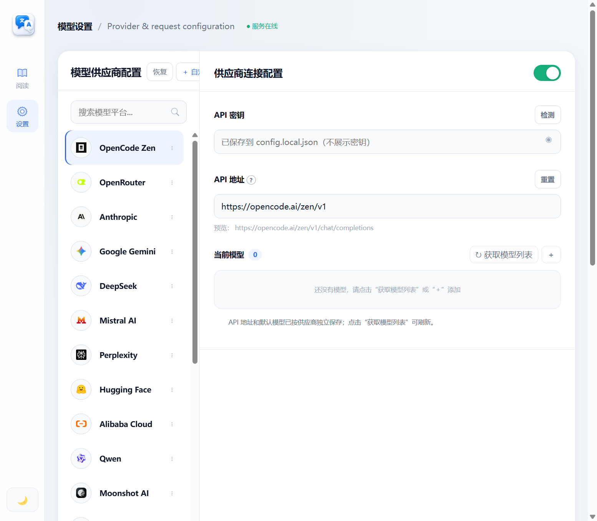

# EchoLang

> **A quiet, precise translation desk for long-form reading.**
>
> 一个把原文、译文和模型请求放在同一张桌面上的本地优先翻译工作台。

[](https://github.com/Mu-scorpio/EchoLang/releases/latest)
[](https://github.com/Mu-scorpio/EchoLang/releases/latest)
[](https://nodejs.org/)


EchoLang 不是一个把长文切碎后丢进聊天框的翻译器。它保留段落顺序和阅读节奏，让你在原文、中英对照和译文之间快速切换；每次请求发给 AI 的完整提示词也会在设置页实时展示，方便检查、复制和复现。

## 亮点

| 能力 | 体验 |
| --- | --- |
| **阅读优先** | 用清晰的段落版式阅读长文，保留段落编号、顺序和上下文。 |
| **三段式阅读滑块** | 原文 / 中英对照 / 翻译，一次点击切换，不打断阅读。 |
| **完整提示词可见** | 设置页展示实际请求格式、翻译规则和当前段落数据，支持一键复制。 |
| **多供应商工作流** | 内置供应商目录，支持拖拽或上下移动排序，也支持自定义 OpenAI-compatible 接口。 |
| **本地优先配置** | API Key 由后端保存到本地 JSON，不进入浏览器缓存，不会被静态路由暴露。 |
| **常用文档导入** | 支持 Markdown、TXT、DOCX、PDF，并保留可继续翻译的段落结构。 |
| **网页 + 桌面双形态** | 同一套源码可以启动本地网站，也可以打包成无需 Node.js 的 Windows 应用。 |

## 下载 Windows 应用

前往 [最新 Release](https://github.com/Mu-scorpio/EchoLang/releases/latest)：

- **`EchoLang-0.3.0-setup.exe`**：标准安装版，可创建桌面和开始菜单快捷方式。
- **`EchoLang-0.3.0-portable.exe`**：便携版，下载后直接运行，不写入安装目录。
- **`EchoLang-0.3.0-web-source.zip`**：可自行部署为网站的源码包。

桌面版已经内置 Electron、Node.js 运行时和文档解析依赖，普通用户不需要额外安装 Node.js。桌面版的本地配置默认保存在：

```text
%APPDATA%\EchoLang\config.local.json
```

## 5 分钟启动网页源码

网页版本需要 Node.js 20+。在项目根目录执行：

```powershell
npm install
Copy-Item config.example.json config.local.json
notepad config.local.json
npm start
```

然后打开 <http://127.0.0.1:4173>。

在 `config.local.json` 中填写供应商信息；也可以直接在“模型设置”里填写 API Key 并点击“检测”。配置文件已被 Git 忽略，请不要把真实密钥提交到仓库。

生产环境建议让 Node 服务只监听本机，再由 Nginx、Caddy 或其他反向代理提供 HTTPS；不要把包含密钥配置能力的本地服务直接暴露到公网。

## 桌面版源码启动

如果希望从源码运行 Electron 外壳：

```powershell
cd EchoLang-Desktop
npm install
npm start
```

也可以双击 [EchoLang-Desktop/start.bat](EchoLang-Desktop/start.bat)。开发模式会调用上级目录的网页源码；发布版则把网页、后端和依赖放在安装包的资源目录中，并使用 Electron 自身运行时启动后端。

## 构建 EXE

在 `EchoLang-Desktop` 目录执行：

```powershell
npm install
npm run dist
```

产物位于 `EchoLang-Desktop/dist/`：

```text
EchoLang-0.3.0-setup.exe       # NSIS 安装版
EchoLang-0.3.0-portable.exe    # 便携版
```

如只想验证未压缩目录包：

```powershell
npm run dist:dir
```

## 供应商与提示词

EchoLang 把“模型设置”拆成几个可以检查的层次：

1. 选择供应商并填写 API 地址、模型和 API Key。
2. 点击“检测”，API Key 写入本地 `config.local.json`，浏览器输入框只保留“已保存”状态。
3. 在“请求提示词”中调整前置指令。
4. 查看“实际发送预览”，确认当前供应商的消息格式、翻译约束和段落 JSON。

OpenAI-compatible 供应商会显示 `messages[0].content`；Anthropic 会把 `system` 和用户消息分开显示。这个预览使用当前文档的第一段作为请求样本，展示的提示词构造逻辑与实际翻译请求共用。

## 项目结构

```text
EchoLang/
├─ index.html                 # 阅读器、设置页和浏览器端运行时
├─ server.mjs                 # 静态服务、文档解析、供应商请求和 SSE 翻译
├─ app/providers.js            # 内置供应商目录
├─ app/document-store.js       # IndexedDB 文档持久化
├─ assets/                    # 供应商 Logo 和界面图标
├─ config.example.json        # 本地配置模板，不含真实密钥
├─ EchoLang-Desktop/          # Electron 外壳和 Windows 打包配置
└─ docs/screenshots/          # README / Release 截图
```

## 截图

### 阅读工作台


### 模型与供应商设置



## 开发检查

```powershell
node --check server.mjs
cd EchoLang-Desktop
npm run check
```

发布构建还会验证打包后的 Electron 目录能自行启动后端，并通过 `/api/health` 返回 200。Release 同时保留网站源码和 Windows EXE，便于选择在线部署或本地运行。

## 发布内容

每个 Release 包含：

- 可直接安装的 Windows EXE；
- 不需要安装的 portable EXE；
- 可用于 Node.js 网站部署的源码 ZIP；
- GitHub 仓库中的完整源码、构建配置和截图。

如果你要快速试用，下载便携版即可；如果要部署到服务器，下载 `web-source.zip` 并按上面的 Node.js 步骤启动。
